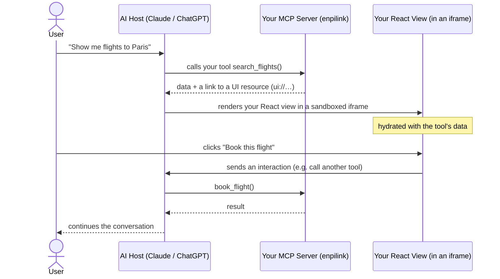
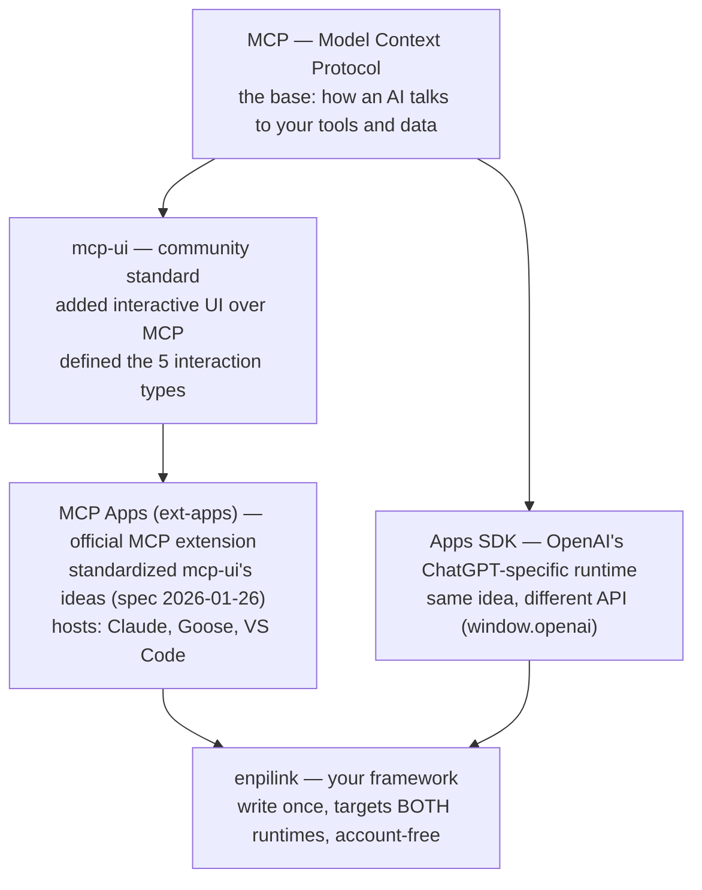
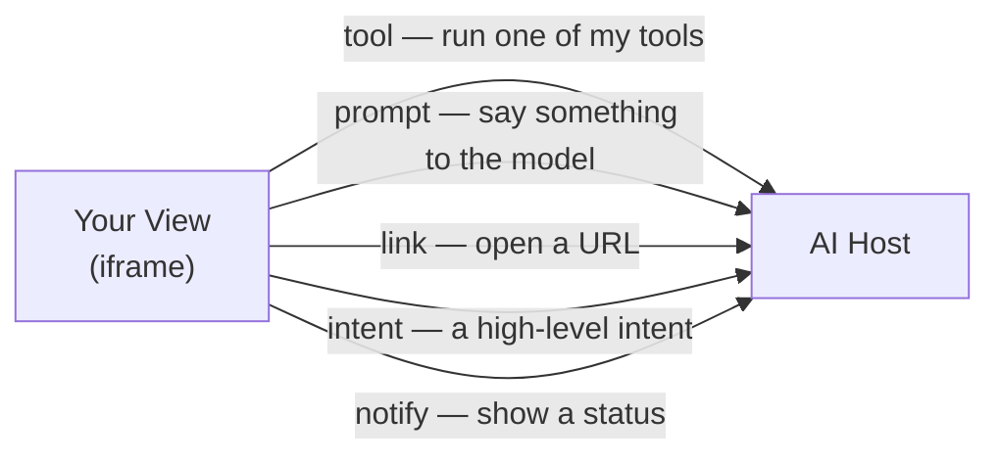
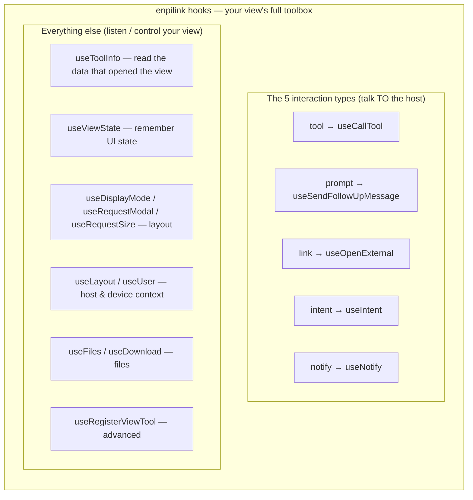
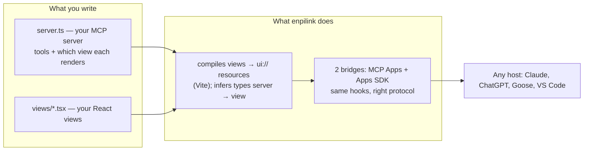
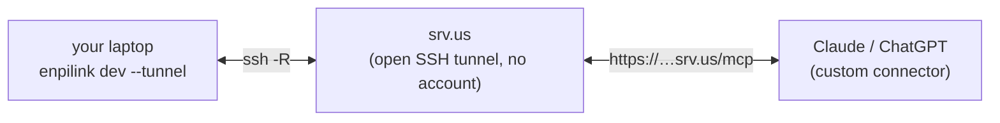
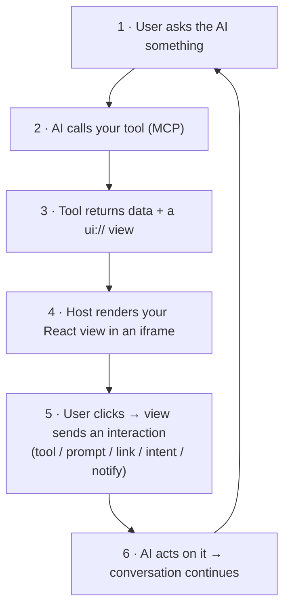

# enpilink — How it works, end to end

A plain-language tour of the platform: what it is, the problem it solves, the
standards it builds on, and the technology underneath. No prior knowledge
assumed — every term is explained the first time it appears.

> **One-line version:** enpilink lets you build small interactive apps — cards,
> forms, buttons, dashboards — that appear **inside an AI chat** (Claude,
> ChatGPT, …) instead of the AI replying with only text. You write them **once**,
> and they run in every supported AI host. **No account, no vendor lock-in.**

---

## 1. The problem

Today, when you ask an AI assistant something, it answers with a **wall of
text**. You can't click a product, pick a date on a calendar, swipe through
flights, or press "Confirm." Everything is words.

**"Apps" fix this:** the assistant can show a *real little user interface*
right in the conversation — a product card with an "Add to cart" button, a
seat map, a form. The AI stays in charge, but now it can *show* instead of only
*tell*.

Three things make this hard, and enpilink removes all three:

| The hard part | What enpilink does |
|---|---|
| **The text-wall problem** — chat is text-only by default. | Lets your tools return interactive **React views**. |
| **The two-runtimes problem** — ChatGPT and Claude each invented their *own* way to embed UI, so you'd build the same app twice. | **Write once, run in both** — one codebase, two runtimes. |
| **The account problem** — the popular toolchain needs a paid account + hosted cloud just to build and share. | **Account-free** — local dev, a free public tunnel, and self-host, with no signup anywhere. |

Think of enpilink as a way to build *a tiny website the AI can drop into the
chat when it's useful* — and that can **talk back** to the AI.

---

## 2. The big picture

Here's the whole loop, start to finish. (A **"view"** = your mini web page. A
**"tool"** = a function on your server the AI can call. An **"MCP server"** =
the small backend you write.)

The view runs in a **sandboxed iframe** (a safe, isolated frame) and
communicates with the host using a small, standard message protocol — never by
reaching directly into the page. enpilink hides all of that behind simple React
functions called **hooks** (more on those in §5–6).

---

## 3. The standards (and how they stack)

This is the part that trips people up, because **four related names** show up.
Here's how they fit together, from the bottom up:

In words:

1. **MCP (Model Context Protocol)** — the foundation. A standard way for an AI
   assistant to discover and call your **tools** (functions) and read your data.
   It's the "USB-C for AI tools." No UI on its own.

2. **mcp-ui** — a community standard that pioneered putting *interactive UI*
   on top of MCP. **This is the one from the lecture you saw.** Its big idea: a
   tool can return a UI resource, and that UI can send a small set of structured
   **interaction types** back to the host (see §4). It defined **five** of them.

3. **MCP Apps** (the `ext-apps` extension) — the **official** MCP standard that
   took mcp-ui's ideas and made them part of MCP proper (stable spec
   `2026-01-26`). This is what Claude, Goose, VS Code and other MCP hosts speak.

4. **Apps SDK** — OpenAI's **ChatGPT-specific** version of the same concept.
   Same goal (UI in the chat), but a different, proprietary API
   (`window.openai.*`) that only ChatGPT understands.

**enpilink sits on top of the last two.** You write one app; enpilink speaks
*both* MCP Apps and the Apps SDK, so the same view runs in Claude **and**
ChatGPT. It does this with two internal "**bridges**" (`mcp-app` and `apps-sdk`)
that translate one set of developer-facing hooks into whichever protocol the
current host uses.

---

## 4. The five interaction types (the mcp-ui standard)

An **interaction type** is one of the *structured messages a view can send back
to the host*. The view doesn't change the conversation directly — it **emits an
intent**, and the host (the AI) decides what to do. The mcp-ui standard defines
**five**:

| Type | Plain meaning | Example |
|---|---|---|
| `tool` | "Run one of my server's tools and show the result." | Click **Details** → calls `product_details` and renders the product card. |
| `prompt` | "Send this text to the model as if the user typed it." | Click **Suggest pairings** → the model replies with wine suggestions. |
| `link` | "Open this URL (outside the iframe)." | Click **View docs** → opens the docs in a new tab. |
| `intent` | "Here's a high-level thing I want to happen — you route it." | Click **Add to cart** → the host decides how to handle "add_to_cart". |
| `notify` | "Surface a status/notification to the host." | After checkout → a "Saved!" toast/log. |

> **enpilink supports all five.** `tool`, `prompt` and `link` are real,
> first-class on both runtimes. `notify` is the *real* MCP notification on MCP
> Apps. `intent` is a best-effort extension (it never breaks anything — if a
> host doesn't route it, it simply does nothing).

This diagram — a view posting a structured `{ type, payload }` message up to its
host — *is* the mental model from the mcp-ui lecture.

---

## 5. "Interaction types" vs "hooks" — clearing up the two tables

This is the question the README's two tables raise. They are **related but not
the same thing**, and once you see the relationship it's simple:

- **Interaction types** = the **5 standard *actions*** a view can send *up* to
  the host (§4). This is a concept from the standard.
- **Hooks** = enpilink's **React functions** you call inside a view. *Some* hooks
  send those 5 interactions. *Other* hooks do different jobs entirely — reading
  the data that opened the view, remembering UI state, asking to go fullscreen,
  uploading a file, etc.

> **Analogy:** interaction types are the **verbs your view can say to the host**.
> Hooks are **all the tools in your view's toolbox** — and only *some* of those
> tools are those verbs. The rest are for *listening* to the host and
> *controlling* your own view.

So the relationship is: **the 5 interaction types are a subset of the hooks.**

So when you read the README:

- The **"interaction types" table** = the 5 standard ways your view talks back
  (the lecture's concept). *Note: the README currently highlights four
  (`tool`, `prompt`, `notify`, `intent`); the fifth, `link`, is `useOpenExternal`,
  listed under "Navigation/links" in the hooks table.*
- The **"all view hooks" table** = enpilink's **complete** React API — those 5
  interaction hooks **plus** ~12 more for context, state, layout and files.

Same world, two zoom levels: one shows *the standard's verbs*, the other shows
*the whole toolbox*.

---

## 6. The technology underneath

enpilink is a **TypeScript** framework (a pnpm monorepo). You build two things,
and enpilink wires them together with full type-safety:

- **Server** (`server.ts`): you declare **tools** with `registerTool(...)`, and
  for each tool you point at a **view** to render. enpilink builds on the
  official `@modelcontextprotocol/sdk` and `@modelcontextprotocol/ext-apps`.
- **Views** (`views/*.tsx`): ordinary **React 19** components. They read data and
  talk to the host only through **hooks** — never raw browser messaging.
- **Type-safety:** the data a tool returns is **typed all the way into the
  view**, so if the shapes don't match, you get a compile error, not a runtime
  surprise.
- **Two bridges:** the `mcp-app` bridge speaks the official MCP Apps protocol;
  the `apps-sdk` bridge speaks ChatGPT's `window.openai`. You never touch them —
  you just call hooks, and the right bridge does the right thing per host.

---

## 7. Account-free, and live in Claude in seconds

To test your app in a *real* AI, the host needs a public URL for your local
server. enpilink does this with **srv.us** — an open, SSH-based tunnel that
needs **no account, no signup**:

1. `enpilink dev --tunnel` starts your app and opens the tunnel (it auto-creates
   an SSH key the first time — nothing to configure).
2. It prints a public URL like `https://<id>.srv.us/mcp`.
3. Paste that into **Claude → Settings → Connectors → Custom connector**, and your
   app is live in the chat.

No PostHog, no hosted cloud, no API keys — the framework makes **zero** calls to
any vendor service.

---

## 8. The developer experience

- **Local playground (Console):** a browser emulator that lists your tools,
  lets you run them, and renders your views instantly — with hot reload as you
  edit. (It emulates the ChatGPT Apps-SDK runtime, so `notify`/`intent` show up
  as log entries there.)
- **CLI:** `enpilink dev` (develop), `enpilink build` (compile), `enpilink start`
  (run in production), `enpilink create` (scaffold a new app).
- **Scaffolder:** `npm create enpilink my-app` gives you a working starter
  (once the packages are published to npm).
- **Built-in demo:** the **kitchen-sink** example app exercises every hook and
  all the interaction types, and ships with a `SYSTEM_PROMPT.md` you paste into
  Claude to drive it.

---

## 9. Recap in one picture

---

## Glossary (one line each)

- **MCP (Model Context Protocol):** the standard for how an AI talks to your
  tools and data.
- **mcp-ui:** the community standard that added interactive UI over MCP and
  defined the 5 interaction types.
- **MCP Apps / ext-apps:** the official MCP extension that standardized
  interactive UI (spec `2026-01-26`); spoken by Claude, Goose, VS Code…
- **Apps SDK:** OpenAI's ChatGPT-specific version of the same idea.
- **Host (runtime):** the AI app your view runs inside (Claude, ChatGPT, …).
- **MCP server:** the small backend you write — it exposes tools and views.
- **Tool:** a function on your server the AI can call.
- **View:** your React mini-app, rendered in a sandboxed iframe inside the chat.
- **Interaction type:** one of the 5 structured messages a view sends to the
  host — `tool`, `prompt`, `link`, `intent`, `notify`.
- **Hook:** an enpilink React function a view calls; some send interactions,
  others read context / manage state / control layout / handle files.
- **Bridge:** enpilink's per-runtime translator (one for MCP Apps, one for the
  Apps SDK) so one codebase runs in both.
- **Tunnel (srv.us):** an open, account-free way to expose your local app to a
  real AI host over a public HTTPS URL.

---

*enpilink is account-free and open. It is a fork of
[`alpic-ai/skybridge`](https://github.com/alpic-ai/skybridge), maintained by
[Enpitech](https://enpitech.dev).*
