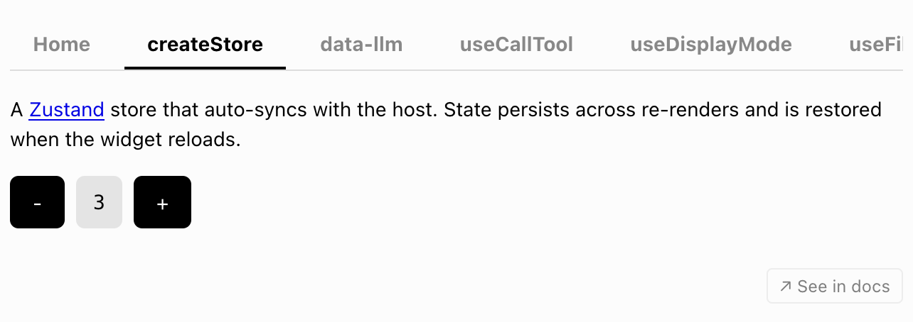
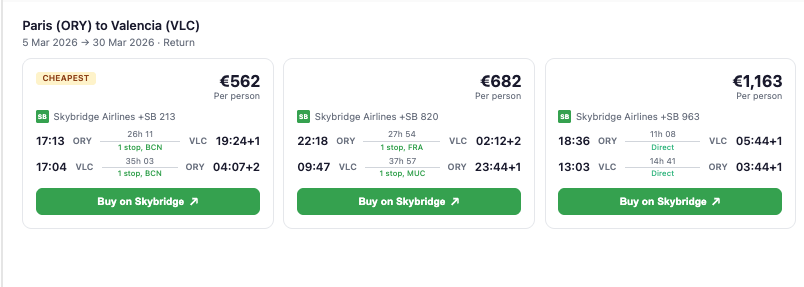
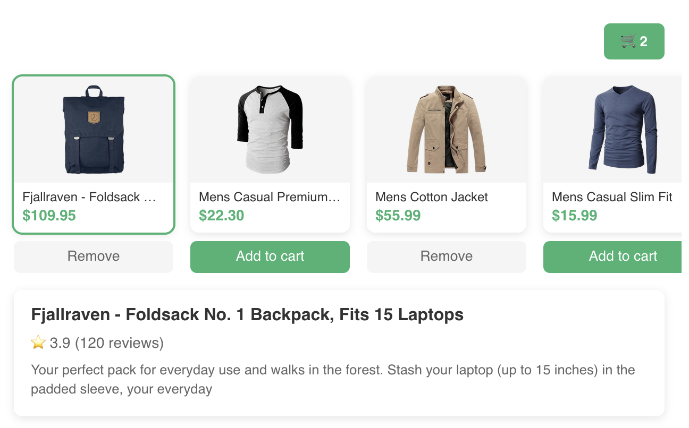
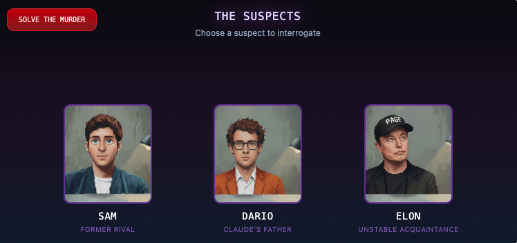
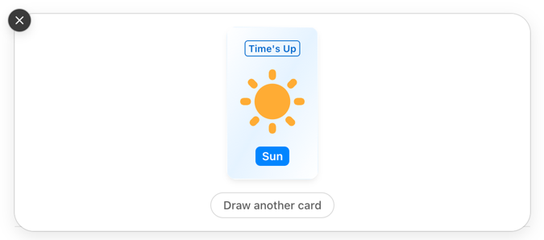
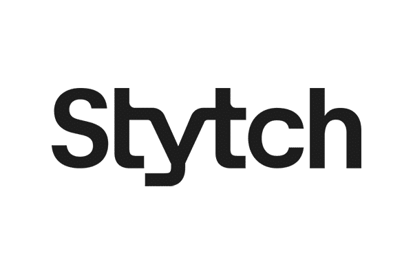
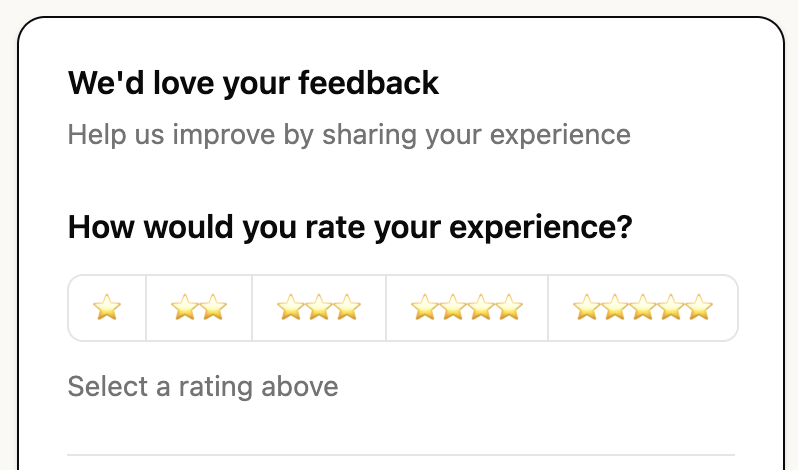

# enpilink - the MCP Apps framework

<p align="center">
  <a href="https://docs.enpitech.dev">
    <picture>
      <source media="(prefers-color-scheme: dark)" srcset="https://raw.githubusercontent.com/enpitech/enpilink/main/docs/images/enpilink-readme-banner-dark.png" />
      
    </picture>
  </a>
</p>

<p align="center">
  <strong>The full-stack React framework for MCP Apps and MCP Servers.</strong>
</p>

<p align="center">
  <a href="https://docs.enpitech.dev">Documentation</a> ·
  <a href="https://docs.enpitech.dev/quickstart/create-new-app">Quickstart</a> ·
  <a href="https://github.com/enpitech/enpilink/tree/main/examples">Examples</a>
</p>

<p align="center">
  <a href="https://www.npmjs.com/package/enpilink"><picture><source media="(prefers-color-scheme: dark)" srcset="https://img.shields.io/npm/v/enpilink?color=77F5EE&amp;labelColor=161B22&amp;style=for-the-badge"></picture></a>
  <a href="https://www.npmjs.com/package/enpilink"><picture><source media="(prefers-color-scheme: dark)" srcset="https://img.shields.io/npm/dm/enpilink?color=D7FFC8&amp;labelColor=161B22&amp;style=for-the-badge"></picture></a>
  <a href="https://discord.com/invite/gNAazGueab"><picture><source media="(prefers-color-scheme: dark)" srcset="https://img.shields.io/badge/Discord-community-77F5EE?style=for-the-badge&amp;logo=discord&amp;logoColor=77F5EE&amp;labelColor=161B22"></picture></a>
  <a href="https://github.com/enpitech/enpilink/blob/main/LICENSE"><picture><source media="(prefers-color-scheme: dark)" srcset="https://img.shields.io/github/license/enpitech/enpilink?color=D7FFC8&amp;labelColor=161B22&amp;style=for-the-badge"></picture></a>
</p>

## About enpilink

enpilink helps developers build type-safe MCP apps for Claude, ChatGPT and other UI-enabled MCP clients, with a complete set of tooling designed for both humans and agents.

Why? MCP apps extend the [Model Context Protocol](https://modelcontextprotocol.io/docs/getting-started/intro) with **rich, interactive UI views** rendered from MCP servers. Conversational apps need seamless interaction between the user, the UI, and the model. This means new UX patterns, developer tooling, and abstractions. 
Plus, the raw SDKs are low-level: no hooks, type safety, HMR, etc.

That's why we built *enpilink*.

Features include:

- **Delightful dev environment**: enpilink provides a dev server with a local emulator, hot module reload, and a permanent tunnel to connect your local app to Claude and ChatGPT.
- **Write once, run everywhere**: the framework abstracts implementation differences between MCP clients, so your app runs seamlessly in Claude, ChatGPT, VSCode, and any other MCP apps compatible client.
- **Agent-ready**: powerful skills, CLI, and programmatic dev tool APIs, everything your coding agent needs to build MCP apps end-to-end.
- **Type-safe end-to-end**: tRPC-style inference from MCP server tool definition to React view for type safety from server to frontend.
- **React-first**: Intuitive React Query-style hooks, with advanced state management. 
- **Example library**: get started quickly with ChatGPT- and Claude-ready app examples for ecommerce, travel, SaaS, and more.

They chose to build their MCP apps with enpilink: 

<p align="center">
  <a href="https://www.datadoghq.com"><picture><source media="(prefers-color-scheme: dark)" srcset="https://raw.githubusercontent.com/enpitech/enpilink/main/docs/images/user-logos/datadog-dark.svg"></picture></a>
  &nbsp;&nbsp;
  <a href="https://bitmovin.com"><picture><source media="(prefers-color-scheme: dark)" srcset="https://raw.githubusercontent.com/enpitech/enpilink/main/docs/images/user-logos/bitmovin-dark.svg"></picture></a>
  &nbsp;&nbsp;
  <a href="https://www.evaneos.com"><picture><source media="(prefers-color-scheme: dark)" srcset="https://raw.githubusercontent.com/enpitech/enpilink/main/docs/images/user-logos/evaneos-dark.svg"></picture></a>
  &nbsp;&nbsp;
  <a href="https://www.touchstream.media"><picture><source media="(prefers-color-scheme: dark)" srcset="https://raw.githubusercontent.com/enpitech/enpilink/main/docs/images/user-logos/touchstream-dark.svg"></picture></a>
  &nbsp;&nbsp;
  <a href="https://www.cottages.com"><picture><source media="(prefers-color-scheme: dark)" srcset="https://raw.githubusercontent.com/enpitech/enpilink/main/docs/images/user-logos/cottages-dark.svg"></picture></a>
</p>

## Get started

**For agents**

Install our [skill](https://docs.enpitech.dev/devtools/skills) for building MCP apps and ChatGPT apps:
```bash
npx skills add enpitech/enpilink -s enpilink
```
Once installed, ask your agent "What skills do you have?" to confirm, then try:

- _Create a new MCP app_
- _Migrate my MCP server to the enpilink framework_
- _Add a new view to my MCP app_ 

**For humans**

Bootstrap a new project with:
```bash
npm create enpilink@latest my-app
```
For full install instructions, read our [**Quickstart guide**](https://docs.enpitech.dev/quickstart/create-new-app).

## Documentation

The [enpilink documentation](https://docs.enpitech.dev) covers the full lifecycle of building MCP Apps:

- [Fundamentals](https://docs.enpitech.dev/fundamentals): understand MCP Apps, ChatGPT Apps, and how enpilink bridges both runtimes.
- [Core concepts](https://docs.enpitech.dev/concepts): learn about server <> model <> UI data flows, LLM context sync, type safety, and instant local iteration with our devtools.
- [Guides](https://docs.enpitech.dev/guides/fetching-data): build real app behavior with tools, views, state, and model communication.
- [API Reference](https://docs.enpitech.dev/api-reference): browse our MCP server APIs, React hooks, CLI commands, and runtime compatibility.

## Deploy

Deploy enpilink apps instantly on [enpitech](https://enpitech.dev) for scalable hosting, MCP-specific analytics, permanent tunneling, app store compliance auditing and submission help. You can also self-host on any Node.js-compatible platform.

See our [deployment guide](https://docs.enpitech.dev/quickstart/deploy) for the full production path.

## Community & Contributing

We'd love your help improving enpilink. Here are a few ways to get involved:

- **Bugs**: If you run into a bug or unexpected behavior, open a [GitHub Issue](https://github.com/enpitech/enpilink/issues) with a clear reproduction.
- **Questions and ideas**: Need help building with enpilink or have ideas to improve the framework, docs, examples, or developer experience? [Open an issue](https://github.com/enpitech/enpilink/issues).
- **Pull requests**: For code or documentation changes, read the [Contributing Guide](https://github.com/enpitech/enpilink/blob/main/CONTRIBUTING.md) before opening a PR.

enpilink is released under the [MIT License](https://github.com/enpitech/enpilink/blob/main/LICENSE). It is forked from [alpic-ai/skybridge](https://github.com/alpic-ai/skybridge) (MIT); see [NOTICE](https://github.com/enpitech/enpilink/blob/main/NOTICE) for attribution.

### Contributors

Built and maintained with ❤️ by [Harijoe](https://github.com/harijoe), [Fred Barthelet](https://github.com/fredericbarthelet), and the [enpitech](https://enpitech.dev) team.

<a href="https://github.com/enpitech/enpilink/graphs/contributors">
  
</a>

## Example templates

Explore all our example templates in the [Examples](https://docs.enpitech.dev/examples) section of the documentation.

### Basic

| Preview | App | Description | Demo | Code |
| --- | --- | --- | --- | --- |
|  | Everything | Comprehensive playground app showcasing all enpilink hooks and features. | [Try Demo](https://everything.enpilink.tech/try) | [View code](https://github.com/enpitech/enpilink/tree/main/examples/everything) |

### Use cases

| Preview | App | Description | Demo | Code |
| --- | --- | --- | --- | --- |
|  | Capitals Explorer | Interactive world map with geolocation, country information, and dynamic capital exploration. | [Try Demo](https://capitals.enpilink.tech/try) | [View code](https://github.com/enpitech/enpilink/tree/main/examples/capitals) |
|  | Flight Booking | Flight search carousel with route details, pricing comparison, and external booking. | [Try Demo](https://flight-booking.enpilink.tech/try) | [View code](https://github.com/enpitech/enpilink/tree/main/examples/flight-booking) |
|  | Ecommerce Carousel | Product carousel with persistent cart, localization, theme switching, and modal dialogs. | [Try Demo](https://ecommerce.enpilink.tech/try) | [View code](https://github.com/enpitech/enpilink/tree/main/examples/ecom-carousel) |
|  | Investigation Game | Multi-screen mystery game with fullscreen mode, dynamic story progression and context asynchronicity demonstration | [Try Demo](https://investigation-game.enpilink.tech/try) | [View code](https://github.com/enpitech/enpilink/tree/main/examples/investigation-game) |
|  | Productivity | Interactive analytics dashboard with charts, theme adaptation, localization, fullscreen mode, and bidirectional tool calls. | [Try Demo](https://productivity.enpilink.tech/try) | [View code](https://github.com/enpitech/enpilink/tree/main/examples/productivity) |
|  | Time's Up | Word-guessing party game where the user gives hints and the AI tries to guess. | [Try Demo](https://times-up.enpilink.tech/try) | [View code](https://github.com/enpitech/enpilink/tree/main/examples/times-up) |
|  | Lumo — Interactive AI Tutor | Adaptive tutor with Mermaid diagrams, mind maps, quizzes, and fill-in-the-blank exercises. | [Try Demo](https://lumo-mcp-app-39519fdd.enpitech.live/try) | [View code](https://github.com/connorads/lumo-mcp-app) |

### Auth

| Preview | Provider | Description | Code |
| --- | --- | --- | --- |
|  | Clerk | Full OAuth authentication with Clerk and personalized coffee shop search. | [View code](https://github.com/enpitech/enpilink/tree/main/examples/auth-clerk) |
|  | WorkOS AuthKit | Full OAuth authentication with WorkOS AuthKit and personalized coffee shop search. | [View code](https://github.com/enpitech/enpilink/tree/main/examples/auth-workos) |
|  | Stytch | Full OAuth authentication with Stytch and personalized coffee shop search. | [View code](https://github.com/enpitech/enpilink/tree/main/examples/auth-stytch) |
|  | Auth0 | Full OAuth authentication with Auth0 and personalized coffee shop search. | [View code](https://github.com/enpitech/enpilink/tree/main/examples/auth-auth0) |

### UI and component libraries

| Preview | App | Description | Demo | Code |
| --- | --- | --- | --- | --- |
|  | Manifest UI | Agentic component library example for rich AI-powered experiences. | [Try Demo](https://manifest-ui.enpilink.tech/try) | [View code](https://github.com/enpitech/enpilink/tree/main/examples/manifest-ui) |
|  | Generative UI | LLM-generated dynamic UIs with json-render and 36 pre-built shadcn/ui components. | [Try Demo](https://generative-ui.enpilink.tech/try) | [View code](https://github.com/enpitech/enpilink/tree/main/examples/generative-ui) |
