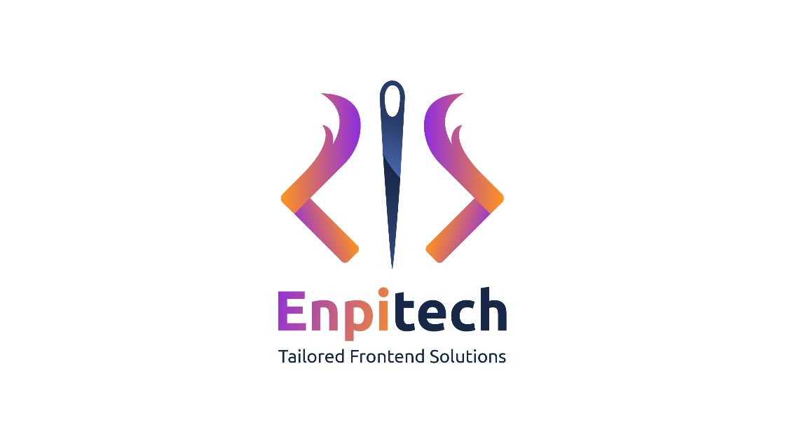

<div align="center">

# enpilink

**The open, account-free full-stack framework for [MCP Apps](https://github.com/modelcontextprotocol/ext-apps) — and the ChatGPT Apps SDK.**

Build type-safe MCP servers whose tools render interactive **React views** inside
Claude, ChatGPT, VS Code, Goose, and any other MCP-Apps-compatible host.

<p>
  <a href="https://github.com/enpitech/enpilink/blob/main/LICENSE"></a>
  <a href="https://github.com/modelcontextprotocol/ext-apps"></a>
  
  
  
  
  
  <a href="https://github.com/enpitech/enpilink/actions/workflows/ci.yml"></a>
  <a href="https://github.com/enpitech/enpilink/pulls"></a>
</p>

<sub>a fork of <a href="https://github.com/alpic-ai/skybridge"><code>alpic-ai/skybridge</code></a> · powered by</sub>

<a href="https://enpitech.dev"></a>

</div>

---

## Account-free by design

Local dev, public tunneling, and deploy all work with **no account, no token, and
no vendor lock-in**:

- **Account-free tunneling** via [srv.us](https://srv.us) — open and SSH-based, no
  signup. `enpilink dev --tunnel` gives you a public `/mcp` URL in seconds and
  auto-generates an SSH key at `~/.enpilink/id_ed25519` the first time.
- **No telemetry** — zero analytics, no network calls, no embedded keys.
- **Deploy anywhere** — `enpilink build` produces a standard Node server
  (`node dist/__entry.js`); self-host on any platform or container.
- **All four mcp-ui interaction types** — `tool`, `prompt`, `notify`, and `intent`.

## MCP Apps compliance

enpilink is a compliant **MCP Apps** framework, built on the official
[`@modelcontextprotocol/ext-apps`](https://github.com/modelcontextprotocol/ext-apps)
extension (stable spec `2026-01-26`). It serves view resources for both runtimes
so the same view runs in either host:

- `ui://views/ext-apps/*` — MCP Apps (Claude, Goose, VS Code, …)
- `ui://views/apps-sdk/*` — ChatGPT Apps SDK

## The 4 mcp-ui interaction types

Views talk back to the host through hooks (never raw `postMessage`). enpilink
supports all four mcp-ui interaction types:

| Type | Hook | Honest status |
|---|---|---|
| `tool` | `useCallTool` | real on both runtimes (from upstream) |
| `prompt` | `useSendFollowUpMessage` | real on both runtimes (from upstream) |
| `notify` | `useNotify` | **enpilink addition** — real MCP `notifications/message` on MCP Apps; best-effort extension on the ChatGPT Apps SDK |
| `intent` | `useIntent` | **enpilink addition** — no spec equivalent on either runtime; best-effort extension, may no-op on hosts that don't route it |

`notify` and `intent` are guarded and additive: they never throw and degrade to
a no-op (or a log line) on hosts without support. See
[`docs/guides/interaction-types.mdx`](docs/guides/interaction-types.mdx) for the
full per-runtime matrix.

---

## Quickstart

### Prerequisites

- **Node.js ≥ 22**
- `ssh` (ships with macOS/Linux) — only needed for `--tunnel`

### Run the built-in kitchen-sink demo

The fastest way to see everything is the bundled **kitchen-sink** showcase
(a fictional store, *Northwind*): 9 tools, 9 views, all 4 interaction types,
every host hook, deterministic mock data.

```bash
git clone https://github.com/enpitech/enpilink
cd enpilink && pnpm install && pnpm run build

cd examples/kitchen-sink
pnpm dev          # local devtools emulator + HMR at http://localhost:3000/
pnpm dev:tunnel   # opens an account-free srv.us tunnel and prints a public /mcp URL
```

Then connect it to Claude:

1. Copy the printed `https://<hash>.srv.us/mcp` URL.
2. In Claude → **Settings → Connectors → Add custom connector**, paste that URL.
3. Paste the contents of
   [`examples/kitchen-sink/specs/SYSTEM_PROMPT.md`](examples/kitchen-sink/specs/SYSTEM_PROMPT.md)
   into your Claude **project instructions** (MCP can't set a host system prompt,
   so this tells the assistant which tools to call).

### Scaffold a new app

```bash
npm create enpilink@latest my-app
```

> **POC distribution caveat.** `enpilink` and `@enpilink/devtools` are not yet
> published to npm, so a freshly scaffolded app's `npm install` will fail on the
> `workspace:*` ranges in the templates. For real distribution, publish both
> packages to npm and run `node scripts/bump.js <version>` to rewrite the
> templates' `workspace:*` ranges to `^<version>`. Until then, scaffold inside
> this monorepo (the templates resolve via the workspace) or use local
> `pnpm pack` tarballs. See [Status](#status) below.

The account-free tunnel under the hood is just one SSH command:

```bash
ssh srv.us -R 1:localhost:<port>
```

enpilink wraps this with auto key-gen (`~/.enpilink/id_ed25519`), URL parsing,
and auto-reconnect.

---

## CLI

```bash
enpilink dev [--tunnel] [-p <port>]   # dev server + devtools emulator + HMR (alias: enpi)
enpilink build                        # compile server + views → dist/
enpilink start                        # run the production build (node dist/__entry.js)
enpilink create [dir]                 # scaffold a new app (passthrough to create-enpilink)
```

### Production gotcha

The production entry reads the **`__PORT`** environment variable (NOT `PORT`),
defaulting to `3000`:

```bash
__PORT=8080 node dist/__entry.js
```

`enpilink start` sets `__PORT` for you. `enpilink build` also rewrites server
`@/…` path aliases automatically, so you do **not** need `tsc-alias` in your own
build scripts.

---

## Repo layout

```
enpilink/
├── packages/
│   ├── core/             → npm "enpilink": server framework + React hooks + Vite plugin + CLI (oclif + Ink)
│   ├── devtools/         → "@enpilink/devtools": local emulator / playground UI
│   └── create-enpilink/  → "create-enpilink": scaffolder (templates: blank, demo)
├── examples/
│   ├── kitchen-sink/     → the all-features showcase ("Northwind"); basis of the demo template
│   └── manifest-ui/      → minimal single-view smoke-test example
├── docs/                 → Mintlify documentation
├── skills/               → agent skill for building enpilink apps
└── scripts/              → version bump / overrides helpers
```

## Status

This is a POC fork. Today:

- ✅ Local dev, devtools emulator, HMR, build, and self-host all work account-free.
- ✅ The account-free **srv.us** tunnel is live-verified end-to-end (the printed
  `/mcp` URL round-trips over a real public tunnel and survives reconnects).
- ⏳ **Real npm distribution** requires publishing `enpilink` + `@enpilink/devtools`
  to npm, then running `node scripts/bump.js <version>`. Until then,
  `npm create enpilink` is workspace-linked (works inside this repo / via local
  tarballs, not from a bare `npm install`).

## Attribution & license

enpilink is released under the [MIT License](LICENSE). It is forked from
[`alpic-ai/skybridge`](https://github.com/alpic-ai/skybridge) (MIT); the original
copyright is retained in `LICENSE`, and the fork's changes are summarized in
[`NOTICE`](NOTICE).

Built and maintained by the [Enpitech](https://enpitech.dev) team.
