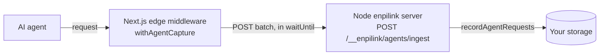

`enpilink/next` exports **`withAgentCapture`**, a Next.js **edge middleware**
adapter for the [agent surface layer](/guides/agent-analytics). The edge runtime
has Web-standard `Request`/`Response`, `fetch`, and `crypto.subtle`, but **no
`better-sqlite3`, no `node:fs`, and no in-process storage** — so it can't write to
your database directly. Instead it captures the request, hashes the IP, and
**POSTs a batch to your own Node enpilink server's beacon sink** inside
`event.waitUntil()`.

<Info>
**This is a capture adapter, not a serve adapter.** It observes the request and
beacons the fingerprint plus the detection. It does **not** port the detect →
serve representation layer to the edge. The authoritative outcome and dead-end
analytics remain your Node/Express server; the edge's job is **detection and the
fingerprint corpus**.
</Info>

## Usage

```typescript
// middleware.ts
import { withAgentCapture } from "enpilink/next";

export const middleware = withAgentCapture({
  enabled: true,
  sinkUrl: "https://your-app.com/__enpilink/agents/ingest",
  token: process.env.ENPILINK_AGENT_INGEST_TOKEN,
  ipSalt: process.env.ENPILINK_AGENT_IP_SALT, // optional; enables cross-runtime hash joins
});

export const config = {
  matcher: ["/((?!_next/static|_next/image|favicon.ico).*)"],
};
```

Pass a handler as the second argument to wrap your own middleware — its response
is returned to Next unchanged, and capture runs entirely off the response path:

```typescript
export const middleware = withAgentCapture(
  { enabled: true, sinkUrl, token },
  (request, event) => {
    // your existing middleware logic; return NextResponse.next(), a redirect, etc.
  },
);
```

## Options

```typescript
interface WithAgentCaptureOptions {
  enabled?: boolean;       // Master switch. OFF by default.
  sinkUrl?: string;        // Your Node server's ingest endpoint. Required when enabled.
  token?: string;          // Shared bearer token the sink validates.
  ipSalt?: string;         // Per-deployment salt for IP hashing. No salt → IP not hashed and not sent.
  siteId?: string;         // Site id to attribute captures to. Default "default".
  sampleRate?: number;     // Sampling fraction [0,1]. Default 1.
  maxBatch?: number;       // Max records per POST. Default 20.
  maxQueue?: number;       // Pending-queue cap; past it, records DROP. Default 1000.
}
```

- **`enabled` + `sinkUrl`** — capture is inert unless `enabled` is explicitly
  `true` **and** a `sinkUrl` is set. Off by default, mirroring the framework's
  capture-off-by-default discipline.
- **`ipSalt`** — when absent, the IP is **not hashed and not sent** (a raw IP is
  never transmitted). Set it to your site's salt so edge-captured hashes join with
  Node-captured ones.

## The beacon topology



The edge middleware POSTs to **your own** Node enpilink server's ingest sink —
customer-to-customer, never to enpitech. The sink:

- is **disabled (404) until you set `ENPILINK_AGENT_INGEST_TOKEN`** — never an open
  write endpoint;
- validates a `Bearer` token (constant-time compare; `401` on a miss). It is a
  **separate secret from the admin token**, so an edge deployment can beacon
  without holding the admin credential;
- zod-validates the batch (bounded to 100 records → `413`; bad shape → `400`);
- degrades to `200 { enabled: false }` with no storage — never a `500`.

Capture runs inside `event.waitUntil()`, so it never blocks, throws onto, or slows
the response; a sink failure is swallowed. See [Telemetry](/telemetry#2-the-edge-beacon-customer-to-customer-not-to-enpitech)
for the privacy framing of this network hop.

## What the edge can and cannot see

<Warning>
**The edge sees less than the Node path. Don't design as if it sees the same.** A
Web `Headers` object lowercases and sorts headers, so:

- **Header casing and order are lost.** The title-cased-client-hints tell that
  identifies **Claude's Chrome-disguise chat fetcher does not fire at the edge** —
  it falls back to `human-or-browser` by shape. Agents named by their User-Agent
  (ChatGPT-User, Gemini, GPTBot, Googlebot, …) are unaffected.
- **The HTTP version is unavailable** (`httpVersion=""`).
- **The `ip-verified` IP tier is unavailable** — it needs a Node-only network
  cache.
- **The downstream response status is unavailable for a pass-through.** Next
  middleware runs *before* the route resolves, so a `NextResponse.next()` /
  `.rewrite()` is recorded with `status=0` (`meta.statusUnknown`) — a genuine
  placeholder, not a fake `200`.
</Warning>

The bulk of detection — every UA-named family, header presence and values, header
count — classifies identically at the edge. The edge is for coverage and the
corpus; keep the Node path as the source of truth for outcomes.

## Related

- [Agent analytics](/guides/agent-analytics#deployment-topologies) — single-server vs. edge + beacon
- [Telemetry](/telemetry) — the network hop, and why data still never reaches enpitech
- [Configuration](/guides/configuration) — `agent.ingestToken` and the `agent.*` keys
- [Storage](/guides/storage) — where beaconed records land
