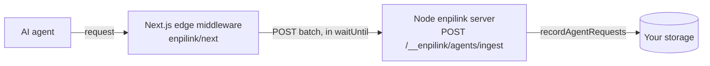

The [agent surface layer](/guides/agent-analytics) installs in **one line** on
every day-one framework. This page is the install reference: the copy-paste
one-liner for your runtime, where captured data lands there, and the honest
caveats per platform. It is **account-free** — no login, no API key, no enpitech
service to sign up for. Detection data comes from a public ruleset (see
[Detection & the live ruleset](/guides/agent-detection-ruleset)); your captured
traffic stays in **your own** storage.

## First, what agents actually do

Before you install anything, internalize the one fact the whole layer is built
around — because it changes what "installing" is even *for*. We measured this
against real agents ([the field report](/guides/agent-analytics#what-we-learned-and-why-the-design-looks-the-way-it-does)):

- **Most agent traffic is chat-mode, and it makes exactly one HTTP request.**
  ChatGPT web, Gemini web, and Claude chat fetch your page **once and never come
  back**. They will not follow a link, an affordance, or an ordinary `<a href>`.
- **They do not run JavaScript.** A client-rendered SPA serves them an empty
  `<div id="app">` — they don't see your site badly, they don't see it at all.
- **They fail silently and then confidently blame you** for failures your server
  log never recorded.

> **For a chat-mode agent, the first response *is* the entire conversation.**

So the layer's real job is to **detect that first request and, optionally, serve
a self-sufficient response into it** — never to hand the agent a second thing to
fetch. Installing the capture adapter is step one (see who's arriving); turning on
serving (`{ serve: true }`) is step two (answer them in that one shot).

<Info>
**Capture is ON the moment you mount a standalone adapter.** Unlike an MCP server
(where capture waits for `ENPILINK_AGENT=1`), the one-line adapters below treat
*installing the middleware* as the explicit opt-in — so capture runs as soon as
you add the line. **Serving stays a separate, deliberate opt-in** (`{ serve: true }`),
because it changes what a client receives. See the [cloaking
guardrail](/guides/agent-analytics#serve-one-self-sufficient-response) — Googlebot
and every indexer always get your normal page.
</Info>

## Express / Node

```typescript
import express from "express";
import { agentCapture } from "enpilink/express";

const app = express();
app.use(agentCapture()); // capture + classify, out of the box
```

Mount it **once, ahead of your routes**. Works in plain Express and any
Express-based framework (NestJS, a custom server). To also serve eligible chat
fetchers a self-sufficient response on a would-be-404:

```typescript
app.use(
  agentCapture({
    serve: true,
    siteTitle: "Northwind",
    siteDescription: "An online store for outdoor gear.",
    siteFacts: ["Ships worldwide", "Prices in USD"],
  }),
);
```

**Storage story.** On first use the adapter **auto-activates the configured
storage** (default **SQLite**, a durable `enpilink.db`). You do **not** need
`ENPILINK_ANALYTICS`, an `McpServer`, or any manual storage wiring — capture
writes straight to the local database. Set `ENPILINK_STORAGE=postgres` (or
`memory`) to change the engine; see [Storage](/guides/storage).

**Account-free.** No login, no key. Detection data is fetched from the [public
ruleset](/guides/agent-detection-ruleset); everything captured is yours, in your
own DB.

See [`agentCapture` (adapters)](/api-reference/agent-capture#express) for the full
option list.

## Hono

```typescript
import { Hono } from "hono";
import { agentCapture } from "enpilink/hono";

const app = new Hono();
app.use("*", agentCapture()); // capture + classify
// app.use("*", agentCapture({ serve: true, siteTitle: "Northwind" }));
```

**Storage story.** Identical to Express — storage auto-activates (default SQLite),
no `ENPILINK_ANALYTICS`, no account.

<Warning>
**Header fidelity depends on the Hono runtime.** On the **Node runtime**
(`@hono/node-server`), the adapter recovers full header order and casing from the
underlying `IncomingMessage` — so the title-cased-client-hints tell that
identifies **Claude's Chrome-disguise chat fetcher fires**, exactly as on Express.
On **any other runtime** (Bun, Deno, edge), Hono exposes only a Web `Headers`
object, which lowercases and sorts headers — so that one casing signal is lost and
Claude-chat falls back to `human-or-browser`. Agents named by their User-Agent
(ChatGPT-User, Gemini, GPTBot, Googlebot) are unaffected. This adapter targets the
Node runtime; for Hono on Cloudflare, use the [Cloudflare adapter](#cloudflare-workers).
</Warning>

## Next.js

Next middleware runs on the **edge runtime**, which has no `better-sqlite3` and no
in-process storage. So the Next adapter is **capture-only**: it detects at the edge
and **beacons the records to your own Node enpilink server**, which writes them to
storage. The one-liner, env-configured:

```typescript
// middleware.ts
export { default } from "enpilink/next";

export const config = {
  matcher: ["/((?!_next/static|_next/image|favicon.ico).*)"],
};
```

Configure it with env vars (Next inlines `process.env.*` at build):

```bash
ENPILINK_AGENT_SINK_URL=https://your-app.com/__enpilink/agents/ingest
ENPILINK_AGENT_INGEST_TOKEN=<a shared secret, also set on your Node server>
ENPILINK_AGENT_IP_SALT=<optional; enables cross-runtime hash joins>
```

Until `ENPILINK_AGENT_SINK_URL` is set, the bare `export { default }` is a **no-op
passthrough** — safe to ship before you've wired the sink. For explicit config or
to wrap your own middleware logic, import the named
[`withAgentCapture`](/api-reference/next-middleware) instead.

**The sink topology.**



The edge POSTs to **your own** Node server's ingest sink (guarded by
`ENPILINK_AGENT_INGEST_TOKEN`) — customer-to-customer, never to enpitech. The sink
is **disabled (404) until you set the token**. See
[Telemetry](/telemetry#2-the-edge-beacon-customer-to-customer-not-to-enpitech).

<Warning>
**The edge sees less than the Node path — don't assume otherwise.** A Web
`Headers` object lowercases and sorts headers, so **header casing and order are
lost**: the title-cased-`Sec-Ch-Ua` tell that identifies **Claude's
Chrome-disguise chat fetcher does not fire at the edge** (it falls back to
`human-or-browser` by shape). Agents named by their User-Agent (ChatGPT-User,
Gemini, GPTBot, Googlebot) are **unaffected**. The HTTP version and the
`ip-verified` tier are also unavailable at the edge, and a pass-through request's
downstream status is recorded as unknown (`status=0`). The edge's job is
**detection and the fingerprint corpus**; keep a Node server as the source of truth
for outcomes.
</Warning>

**Account-free.** The edge adapter also auto-fetches the [public
ruleset](/guides/agent-detection-ruleset) (stale-while-revalidate, off the hot
path) so records classify at the edge — no key, no account.

## Cloudflare Workers

The Cloudflare adapter does **full capture + detect + (opt-in) serve inside the
Worker's `fetch` handler** — the request-path hop the Worker already is, no new
hop, no Node built-ins. Wrap your origin handler:

```typescript
// worker.ts
import { agentCapture, d1CaptureSink, KVRulesetCacheStore } from "enpilink/cloudflare";

export default agentCapture({
  serve: true,
  site: { title: "Acme", description: "Acme's API and docs." },
  // How to get the REAL response (proxy to origin, serve assets, run a router):
  fetchOrigin: (request, env) => env.ASSETS.fetch(request),
  // Store captures in D1 (CF-native) — or use beaconCaptureSink({ sinkUrl }).
  sink: (env) => d1CaptureSink(env.DB),
  // Detection stays fresh from the CDN ruleset, warm across isolates via KV:
  ruleset: { cacheStore: (env) => new KVRulesetCacheStore({ kv: env.RULESET_KV }) },
});
```

<Warning>
**Fail-open is the whole point.** The Worker resolves your **origin response
first**, and the entire capture/serve wrapper runs inside a `try` whose `catch`
returns that origin response untouched. A bug in detection, serving, the ruleset,
or the sink can **never** turn a good page into an error.
</Warning>

**Storage story.** The edge has no local DB, so pick a sink:

- **D1** (`d1CaptureSink(env.DB)`) — CF-native SQLite, writes directly from the
  Worker. Run `ensureD1Schema(env.DB)` once (or apply the exported `D1_SCHEMA`) to
  create the table.
- **Beacon** (`beaconCaptureSink({ sinkUrl, token })`) — POST records to your own
  Node enpilink server's ingest sink, same topology as Next.

**Ruleset cache.** Pass a `KVRulesetCacheStore` (recommended) or
`CacheApiRulesetCacheStore` so the fetched ruleset is **warm across isolates** — a
cold isolate whose cache is empty serves its first request classified `pending`
(capture still works), then the background `waitUntil` warms it for every
subsequent request. Without a cache store the ruleset is held in-isolate only.

**Account-free.** D1 (or your beacon target) is storage you own; the ruleset is
the public keyless fetch. See [`agentCapture`
(adapters)](/api-reference/agent-capture#cloudflare-workers) for D1 and beacon
details.

## Which adapter?

| Runtime | Import | One-liner | Serve? | Storage |
|---|---|---|---|---|
| Express / Node / NestJS | `enpilink/express` | `app.use(agentCapture())` | ✅ in-process | SQLite (auto), Postgres |
| Hono (Node) | `enpilink/hono` | `app.use("*", agentCapture())` | ✅ in-process | SQLite (auto), Postgres |
| Next.js | `enpilink/next` | `export { default } from "enpilink/next"` | ❌ capture-only | beacon → your Node server |
| Cloudflare Workers | `enpilink/cloudflare` | `export default agentCapture({ … })` | ✅ in-Worker, fail-open | D1 or beacon |

<Note>
**Fastify, SvelteKit, Nuxt, Astro, and Vercel Edge** are planned fast-follow
adapters. Each is the same thin shape (capture + detect on a request-path hook);
they follow only because each needs its own adapter, tests, and docs. Today, a
Fastify or SvelteKit app can wrap the Node adapter's core manually, or run behind a
Cloudflare Worker.
</Note>

## Verify it's working

1. Send an agent-shaped request and check it was captured + classified:

   ```bash
   curl -A "GPTBot/1.0" http://localhost:3000/
   ```

2. Open the Console **Agents** tab (or `GET /__enpilink/agents/summary`) — you
   should see the request classified as `gptbot` / `crawler`. If the ruleset
   hasn't loaded yet, it shows as `pending` and backfills once it does (see
   [Detection & the live ruleset](/guides/agent-detection-ruleset)).
3. Confirm the guardrail holds — a `Googlebot` request to a missing path still
   gets your **real 404**, never a served representation.

## Related

- [Agent analytics](/guides/agent-analytics) — the full detect → serve → measure story
- [Detection & the live ruleset](/guides/agent-detection-ruleset) — how detection stays fresh, and the self-host escape hatch
- [`agentCapture` (adapters)](/api-reference/agent-capture) — the reference for Express, Hono, and Cloudflare
- [Next.js edge middleware](/api-reference/next-middleware) — `withAgentCapture` and the beacon topology
- [Configuration](/guides/configuration) — every `agent.*` key, default, and env var
- [Telemetry](/telemetry) — the two network paths, stated plainly
